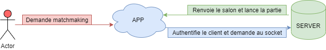
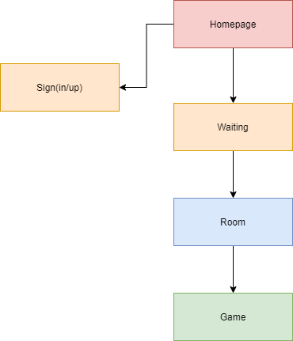
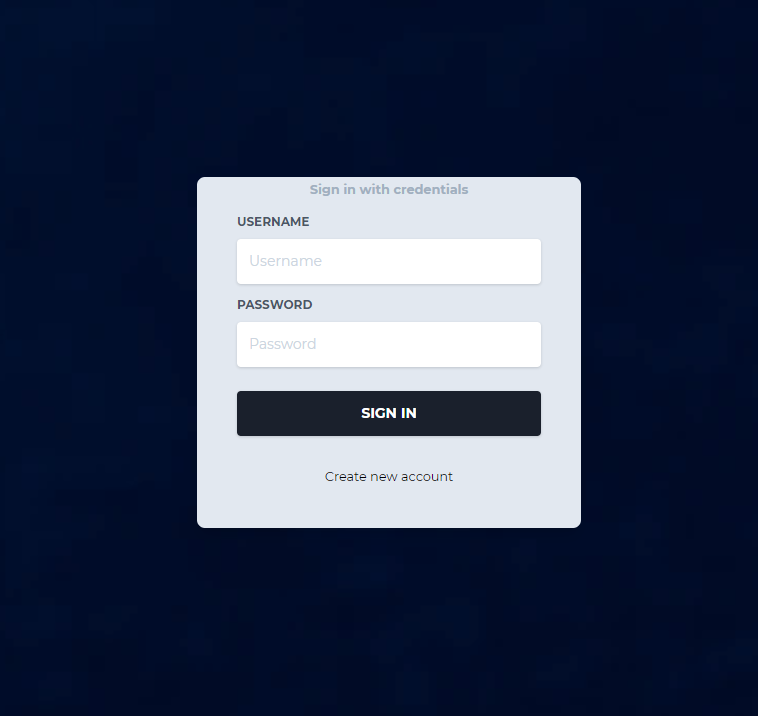
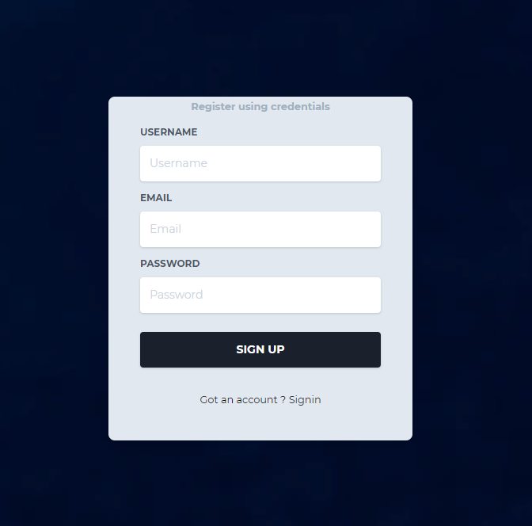
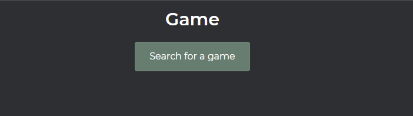
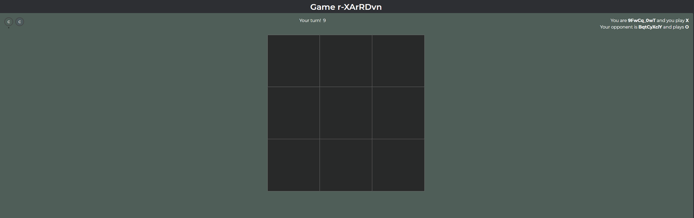
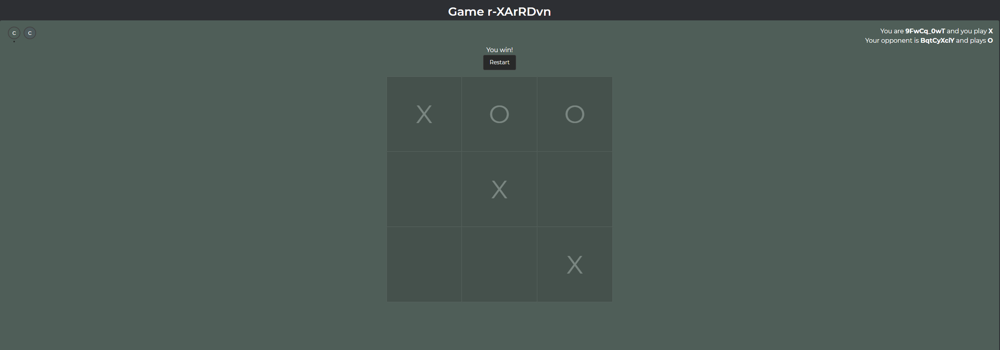
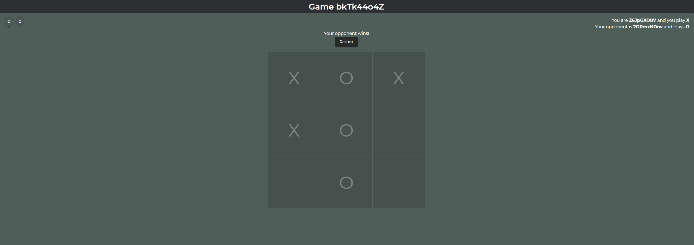
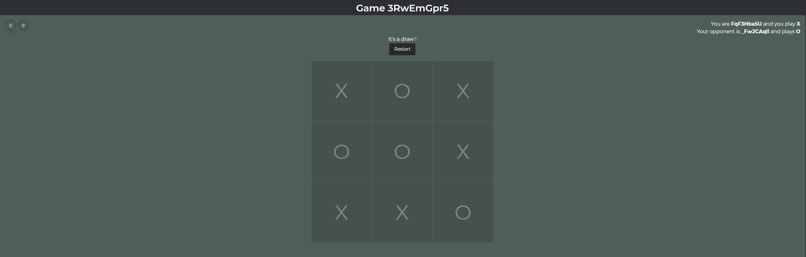

# TicTacToe Online

TicTacToe Online est un jeu de morpion en ligne, le but est simple : on ouvre l'application, on crée une room et on attends que quelqu'un rejoigne celle-ci afin de participer à une bataille endiablée !

## Présentation du projet

TicTacToe Online est une application web destinée aux personnes voulant jouer avec leur amis au morpion en ligne de manière simple et efficace.

TicTacToe Online se veut compatible PC, Mobile, Tablette afin de garantir une expérience multiplateforme à l'utilisateur.

L'application utilise VueJS pour le front-end ainsi que NodeJS couplé à Colyseus, une librairie faisant office de socket.

Electron est ici pour compiler l'application et la rendre multiplateforme à la manière d'un logiciel.

## Le logiciel

L'application a un fonctionnement très simple, ce schema résume celui-ci.

Voici l'architecture du logiciel.

## Fonctionnalités majeures

En tant qu'invité, vous pouvez :

- Chercher les salons de jeu disponibles
- Rejoindre un salon
- Se reconnecter en combat
- Jouer au morpion

Mais, vous pouvez aussi vous inscrire / vous connecter, et grâce à cela, vous pouvez :

- Avoir votre propre pseudo
- Avoir des statistiques
- Faire tout ce qu'un invité peut faire

## Présentation de la BDD

## L'application

Ecrans de connexion/inscription basique

Ecran servant à lancer le matchmaking

Matchmaking en cours !

Arrivée sur le plateau de jeu

On gagne la partie !

Celle ci on la perd ...

Et une égalité :

